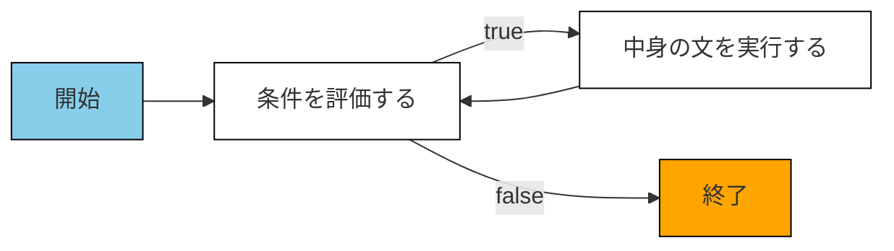
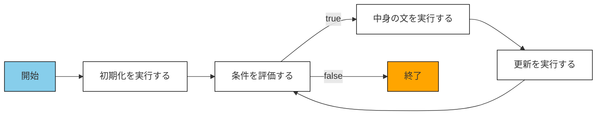

# 繰り返し

- 複雑な処理を記述するには、繰り返しも必要不可欠

+ C++ では、**while文**や**for文**を使う

---

# 繰り返し - while

- while 文: 〜な間、繰り返し実行する
- `while (条件) {中身}`



<style>

.mermaid {
  margin-top: 20px;
}

</style>

---

# 繰り返し - while

<center>


```cpp
int main() {
  int n = 0;
  
  while (n < 4) {
    cout << n << endl;
    n++;
  }
}
```

</center>

<style>

pre[class*='language-'] {
  width: 800px;
  margin-top: 20px;
}

.slidev-code code {
  font-size: 16px  !important;
}

</style>

---

# 繰り返し - while

- 演習問題
  - https://atcoder.jp/contests/apg4b/tasks/APG4b_cm

---

# 繰り返し - for

- for 文: 〜な間、繰り返し実行する
- `for (初期化; 条件; 更新) {中身}`
  - `初期化; while (条件) {中身; 更新; }` と同じ意味になる



<style>

.mermaid {
  margin-top: 40px;
}

</style>

---

# 繰り返し - for

<center>


```cpp
int main() {
  for (int i = 0; i < 5; i++) {
    cout << i << endl;
  }
}
```

</center>

<style>

pre[class*='language-'] {
  width: 800px;
  margin-top: 20px;
}

.slidev-code code {
  font-size: 16px  !important;
}

</style>

---

# 繰り返し - 制御

- `break;` でループを強制終了
- `continue;` でスキップ

<center>

```cpp
for (int i = 0; i < 10; i++) {
  if (i % 2 == 0) {
    continue;
  }
  if (i > 6) {
    break;
  }
  cout << i << endl;
}
```

</center>

<style>

pre[class*='language-'] {
  width: 800px;
  margin-top: 30px;
}

.slidev-code code {
  font-size: 16px  !important;
}

</style>

---

# 繰り返し - ループ変数

- for 文で、ループの回数を数える変数をループ変数という
- ループ変数は、i → j → k の順番で使う

<center>

```cpp
for (int i = 0; i < 4; i++) {
  for (int j = 0; j < 4; j++) {
    cout << i * j << endl;
  }
}

for (int i = 0; i < 10; i++) {
  cout << i << endl;
}
```

</center>

<style>

pre[class*='language-'] {
  width: 800px;
  margin-top: 30px;
}

.slidev-code code {
  font-size: 16px  !important;
}

</style>

---

# 繰り返し - {} の省略

- if などと同様に、中身が単一なら {} を省略できる

<center>

```cpp
for (int i = 0; i < 10; i++) cout << i << endl;

int n = 1;
while (n < 20) n *= 2;
cout << n << endl;
```

</center>

<style>

pre[class*='language-'] {
  width: 800px;
  margin-top: 45px;
}

.slidev-code code {
  font-size: 20px  !important;
}

</style>

---

# 繰り返し - for での省略

- for の初期化、条件、更新は省略できる
  - 条件を省略すると、break までずっと繰り返し続ける

<center>

```cpp
int n = 0;
for (;; n++) {
  if (n > 10) {
    cout << "done" << endl;
    break;
  }
  cout << n << endl;
}
```

</center>

<style>

pre[class*='language-'] {
  width: 800px;
  margin-top: 20px;
}

.slidev-code code {
  font-size: 20px  !important;
}

</style>

---

# 繰り返し

- 演習問題
  - https://atcoder.jp/contests/APG4b/tasks/APG4b_cl
